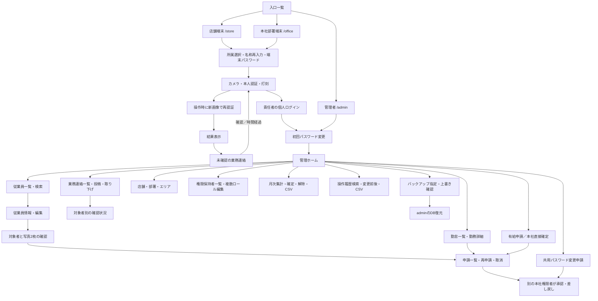

# 画面遷移図 Ver.3

```mermaid
flowchart TD
    root[入口一覧] --> store[店舗端末 /store]
    root --> office[本社部署端末 /office]
    root --> admin[管理者 /admin]
    store --> select[所属選択・名称再入力・端末パスワード]
    office --> select
    select --> clock[カメラ・本人認証・打刻]
    clock --> reauth[操作時に新画像で再認証]
    reauth --> result[結果表示]
    result --> notice[未確認の業務連絡]
    notice -->|確認／時間経過| clock
    clock --> personal[責任者の個人ログイン]
    personal --> force[初回パスワード変更]
    admin --> force
    force --> home[管理ホーム]
    home --> people[従業員一覧・検索]
    people --> detail[従業員情報・編集]
    detail --> photo[対象者と写真2枚の確認]
    photo --> request[申請一覧・再申請・取消]
    home --> shift[勤怠一覧・勤務詳細]
    shift --> request
    home --> leave[有給申請／本社直接確定]
    leave --> request
    request --> review[別の本社権限者が承認・差し戻し]
    home --> messages[業務連絡一覧・投稿・取り下げ]
    messages --> readers[対象者別の確認状況]
    home --> org[店舗・部署・エリア]
    home --> grants[権限保持者一覧・複数ロール編集]
    home --> month[月次集計・確定・解除・CSV]
    home --> history[操作履歴検索・変更前後・CSV]
    home --> backup[バックアップ指定・上書き確認]
    backup --> restore[adminのDB復元]
    home --> shared[共用パスワード変更申請]
    shared --> review
```

本社以外は担当範囲のみ。月次・履歴・バックアップ操作はhq/admin、復元はadmin。adminの付与・解除は画面でなくサーバーコマンドで行います。
