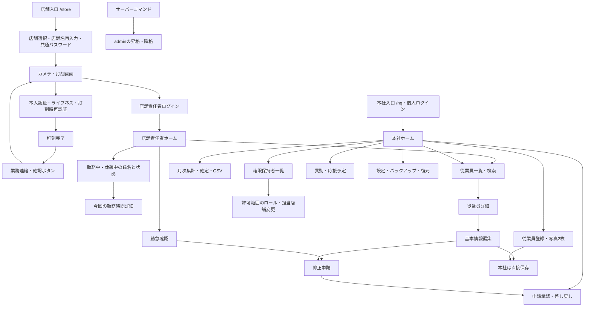

# Face Attendance Web 画面遷移図

```mermaid
flowchart TD
    Store[店舗入口 /store] --> Select[店舗選択・店舗名再入力・共通パスワード]
    Select --> Clock[カメラ・打刻画面]
    Clock --> Verify[本人認証・ライブネス・打刻時再認証]
    Verify --> Result[打刻完了]
    Result --> Notice[業務連絡・確認ボタン]
    Notice --> Clock
    Clock --> ManagerLogin[店舗責任者ログイン]
    ManagerLogin --> ManagerHome[店舗責任者ホーム]
    ManagerHome --> Working[勤務中・休憩中の氏名と状態]
    Working --> WorkingDetail[今回の勤務時間詳細]
    ManagerHome --> Attendance[勤怠確認]
    Attendance --> Request[修正申請]
    ManagerHome --> People[従業員一覧・検索]
    People --> Person[従業員詳細]
    Person --> Edit[基本情報編集]
    Edit --> Request
    HQLogin[本社入口 /hq・個人ログイン] --> HQHome[本社ホーム]
    HQHome --> People
    Edit --> Direct[本社は直接保存]
    HQHome --> Register[従業員登録・写真2枚]
    Register --> Direct
    HQHome --> Review[申請承認・差し戻し]
    Request --> Review
    HQHome --> Monthly[月次集計・確定・CSV]
    HQHome --> Roles[権限保持者一覧]
    Roles --> RoleChange[許可範囲のロール・担当店舗変更]
    Console[サーバーコマンド] --> Admin[adminの昇格・降格]
    HQHome --> Plans[異動・応援予定]
    HQHome --> Maintenance[設定・バックアップ・復元]
```
